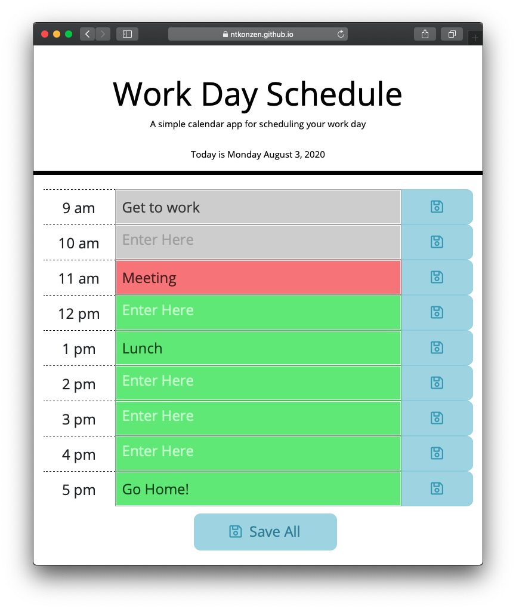

# Work Day Schedule

I built this Work Day Scheduler to assist anyone who needs a simple application to plan out their work schedule. The application easily displays what hour it currently is and what you have ahead of you in your day. This was my first time using jQuery in a full application so I learned a lot about how jQuery and the DOM. 

When entering new information into each input area, you can save the line you're currently on by clicking the "Enter" key or clicking the save icon on the right. If you would prefer, you can fill everything out and click the 'Save All' button at the bottom of the page.

[GitHub Pages Link](https://ntkonzen.github.io/Work-Day-Schedule/)

---
Copyright (c) 2020 Konzen, Nicholas

Permission is hereby granted, free of charge, to any person obtaining a copy
of this software and associated documentation files (the "Software"), to deal
in the Software without restriction, including without limitation the rights
to use, copy, modify, merge, publish, distribute, sublicense, and/or sell
copies of the Software, and to permit persons to whom the Software is
furnished to do so, subject to the following conditions:

The above copyright notice and this permission notice shall be included in all
copies or substantial portions of the Software.

THE SOFTWARE IS PROVIDED "AS IS", WITHOUT WARRANTY OF ANY KIND, EXPRESS OR
IMPLIED, INCLUDING BUT NOT LIMITED TO THE WARRANTIES OF MERCHANTABILITY,
FITNESS FOR A PARTICULAR PURPOSE AND NONINFRINGEMENT. IN NO EVENT SHALL THE
AUTHORS OR COPYRIGHT HOLDERS BE LIABLE FOR ANY CLAIM, DAMAGES OR OTHER
LIABILITY, WHETHER IN AN ACTION OF CONTRACT, TORT OR OTHERWISE, ARISING FROM,
OUT OF OR IN CONNECTION WITH THE SOFTWARE OR THE USE OR OTHER DEALINGS IN THE
SOFTWARE.